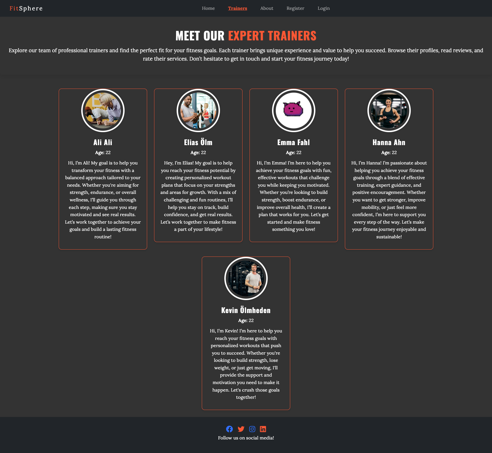
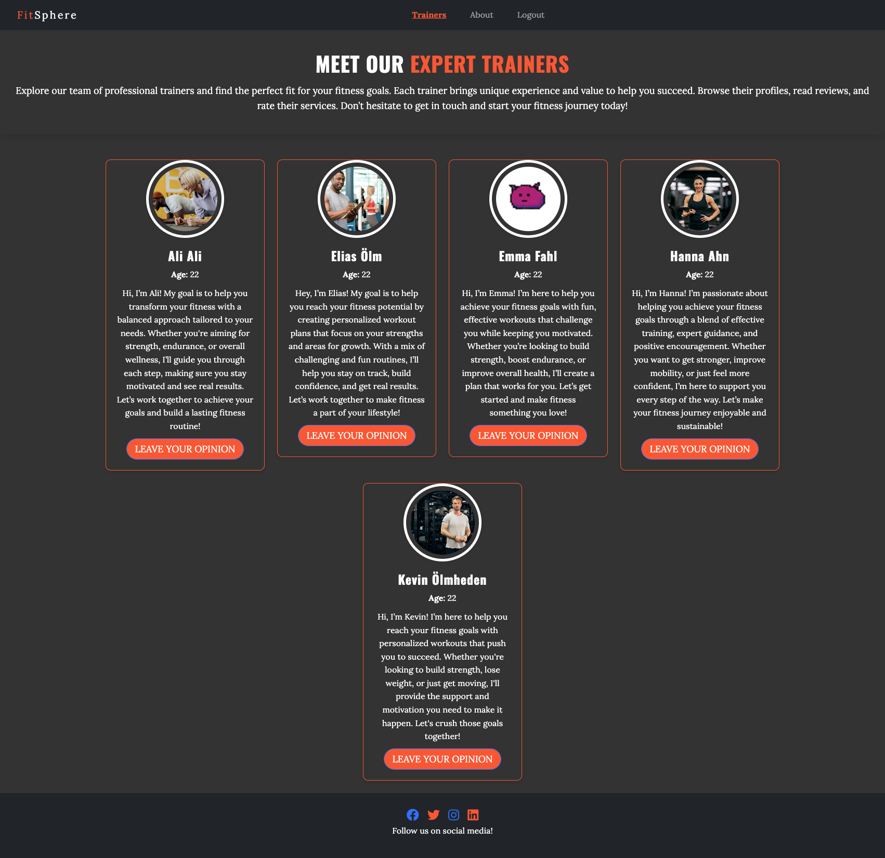
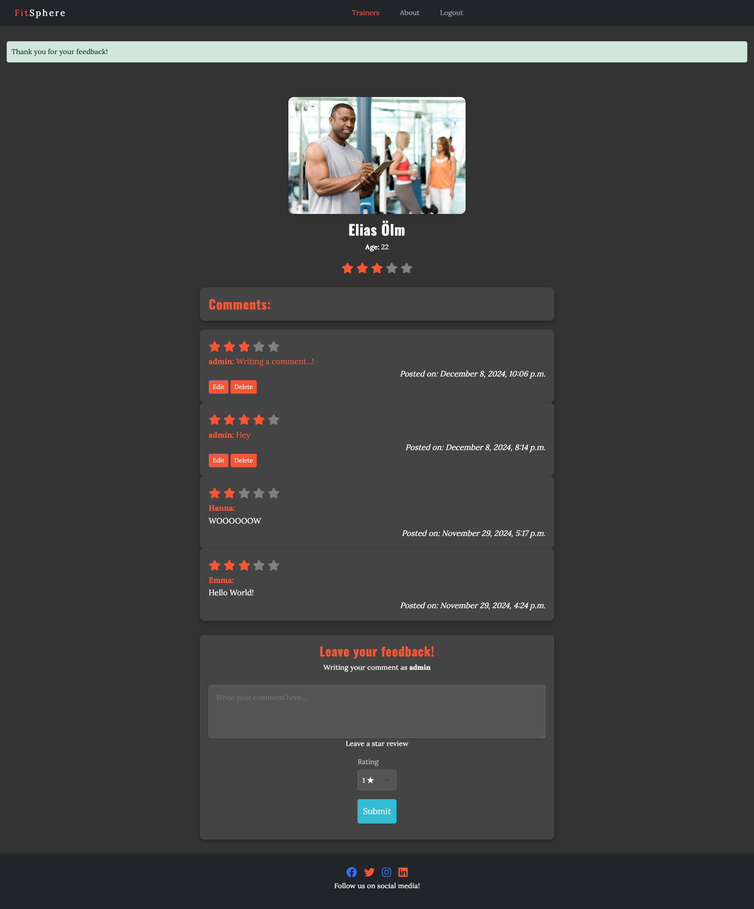
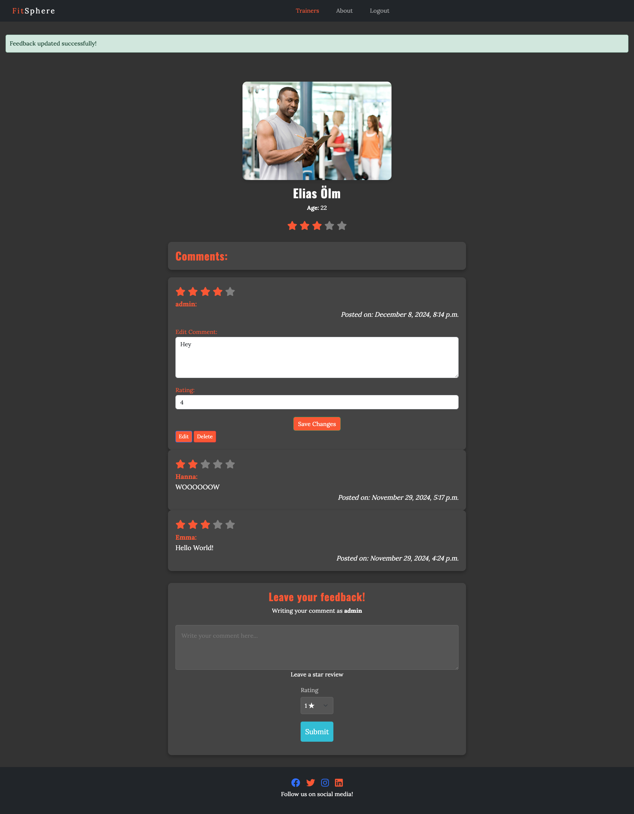
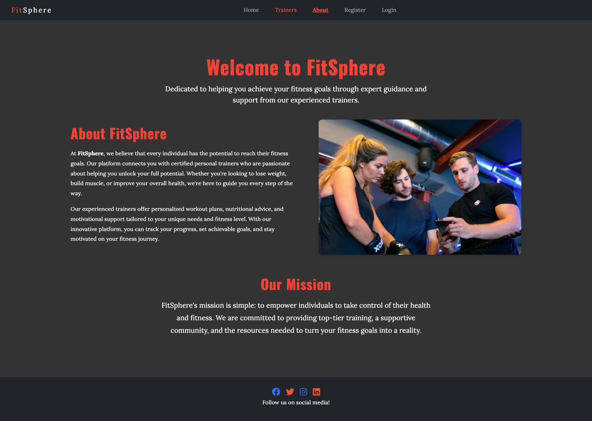
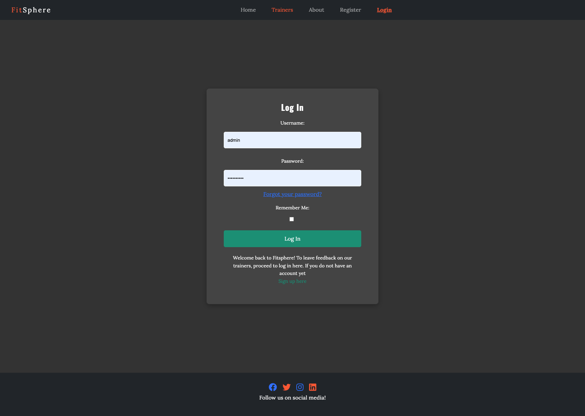
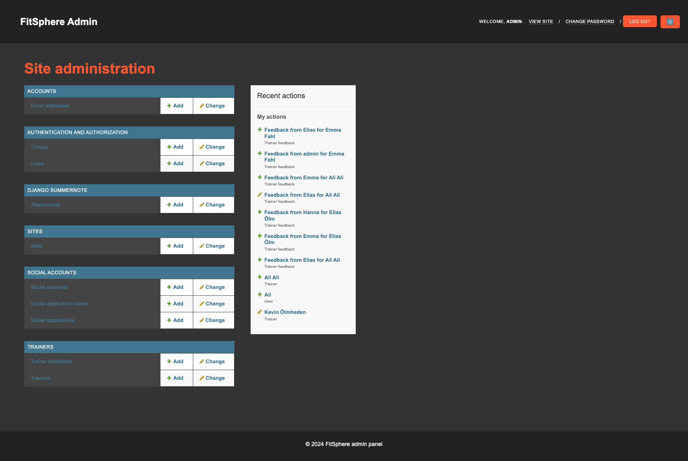

# FitSphere

## Features

Web application has the following pages:
- home page
- trainers page
- trainer profile page
- about page
- register page
- login page

- Each page has a navbar and a footer

**Navbar**

Branding is important which is why the modern and minimalistic design of our brandtitle is in the top left corner.

The navbar has the following links:
- home page
- trainers
- about
- register
- login

The nav has a modern and darker tone to it making it vibrant but minimalistic to the user.
It has two modes, one for desktop as shown in the previous image and one for mobile:

A hamburger toggle making it easy for the user to scroll through the pages.

The navbar changes dynamically if the user is signed in or not, making the content that is relevant in focus.

**Footer**

The footer is a simplistic design containing only the relevant socialmedia links:

- Instagram
- Linkedin
- Facebook
- Twitter

For the mobile version of the website, the footer looks as follows:

  

**Home page**

The home page has a beutiful background video of 2 people jogging.

Above the video there is an overlay displaying a CTA or call to action, for the user to sign up and make change.

**Trainers page**

The "Trainers" page on your website is a sleek, visually appealing showcase of all current personal trainers available. Each trainer is displayed in a neatly organized card format, making it easy for users to browse through the available professionals. The cards are elegantly designed, with high-quality photos of the trainers that reflect their expertise and personality. The styling includes clean lines, vibrant colors, and modern typography, giving the page a fresh and inviting feel.

Each trainer's card includes key details like:

- Portfolio image of the trainer
- Trainer's Name – Bold and easy to read at the top of the card.
- Specialization – A short description of their expertise (e.g., Strength Training, Yoga, HIIT).
- Brief Bio – A snapshot of their background and experience.
- Additional Features for Signed-in Users:

For users who are signed in, the experience becomes more interactive. They will see a "Leave Feedback" button on each trainer's card, allowing them to provide direct feedback on their sessions with that particular trainer. This gives users the opportunity to share their experiences, while also offering the trainers valuable insights to improve their services. The feedback button is prominently placed, encouraging users to engage while being unobtrusive to the overall design.

The page's layout is responsive, ensuring an optimal viewing experience across devices, from desktops to mobile phones. It’s a clean, easy-to-navigate page designed to help users find the perfect trainer, whether they are browsing or looking to share their feedback.

**Trainers Profiles**

The Trainer Profile page offers an in-depth view of each personal trainer, providing users with all the relevant information they need to make an informed decision about working with a trainer. The page expands on the details shown on the "Trainers" page, presenting a more comprehensive layout, ideal for users who want to learn more about a trainer's qualifications, experience, and client feedback.

At the top of the page, users are greeted with the trainer's high-quality photo and name, accompanied by their specialization (e.g., Strength Training, Pilates, Nutrition Coaching). Directly beneath, there’s a detailed bio that highlights their expertise, certifications, training philosophy, and approach to fitness. This section is designed to build trust by giving users a deep dive into what makes the trainer unique.

The trainer’s star rating is displayed prominently here as well, with an average rating calculated from the feedback provided by previous clients. The stars are also clickable, allowing users to see more detailed reviews.

**About Page**

The About page is designed to inspire and engage visitors, providing them with a clear understanding of the core values and mission behind your platform. This page highlights the unique benefits of using your personal training service, encouraging users to sign up and become part of the community.

At the top of the page, visitors are greeted with a high-quality, motivational image that perfectly captures the essence of your brand — whether it’s an image of a personal training session in action, a smiling trainer working with a client, or a dynamic group fitness activity. The image is carefully selected to evoke a sense of empowerment, determination, and community, visually demonstrating the positive impact that working with the right trainer can have on one's fitness journey.

**Register Page**

One of the standout features of our platform is the seamless and intuitive registration process that makes signing up quick, easy, and secure. We’ve designed the registration form to be as user-friendly as possible, ensuring that new users can get started with just a few simple steps, all while enjoying a smooth and visually appealing experience.

**Log In Page**

The Login Page is designed to provide a smooth, hassle-free experience for users returning to the platform. We’ve prioritized both usability and security, ensuring that logging in is quick, simple, and efficient while also safeguarding your personal information.

- Simple and Clear Layout: The login page features a clean and straightforward design, with easy-to-understand fields for Username and Password. There are no distractions, allowing users to focus on logging in quickly and efficiently.

- Instant Feedback and Validation: The form provides real-time feedback as users enter their login credentials. If the username or password is incorrect, a gentle error message is displayed, letting users know immediately what needs to be fixed. This helps eliminate confusion and ensures a smoother experience.

- "Remember Me" Option: For those who want to skip entering their credentials each time they visit, the form includes a convenient "Remember Me" checkbox. When checked, users can stay logged in across sessions, making it easier to return to the platform without needing to enter their details every time.

- Password Reset: In case users forget their password, there’s a "Forgot Password?" link, which takes them through a simple and secure password recovery process. A quick email prompt allows them to reset their password and regain access to their account in no time.

- Sleek and Modern Design: The login form is styled to be both functional and visually appealing, featuring smooth edges, intuitive layout, and a visually integrated color palette. The design follows the same modern aesthetic as the rest of the site, ensuring consistency and a polished user experience.

**Admin Page**

The Admin Page is a powerful, streamlined dashboard designed for superusers to efficiently manage and oversee all aspects of the platform. From monitoring user feedback to updating trainer profiles and overseeing user accounts, this page provides an organized interface that ensures smooth operation and control over the platform’s content and community.

- View & Edit Trainer Profiles: Superusers can easily view and edit all trainer profiles, including their names, bios, specializations, certifications, and more. The editing interface is simple to use, with fields clearly labeled and organized for quick updates.

- View & Edit User Accounts: Superusers can access detailed user profiles, which include account information, training history, and feedback left for trainers. Admins can edit user details if necessary, including account status (active, suspended, etc.).

- Manage Trainer Feedback: Admins can monitor and manage the feedback provided for each trainer. They can view, approve, edit, or delete user comments and ratings if required, ensuring that all reviews meet platform guidelines and maintain quality standards.

**Favicon**

The favicon is a small image that is displayed in the browser's address bar. It is used to identify the website among others and help the user to find it when he/she is searching for it.

---