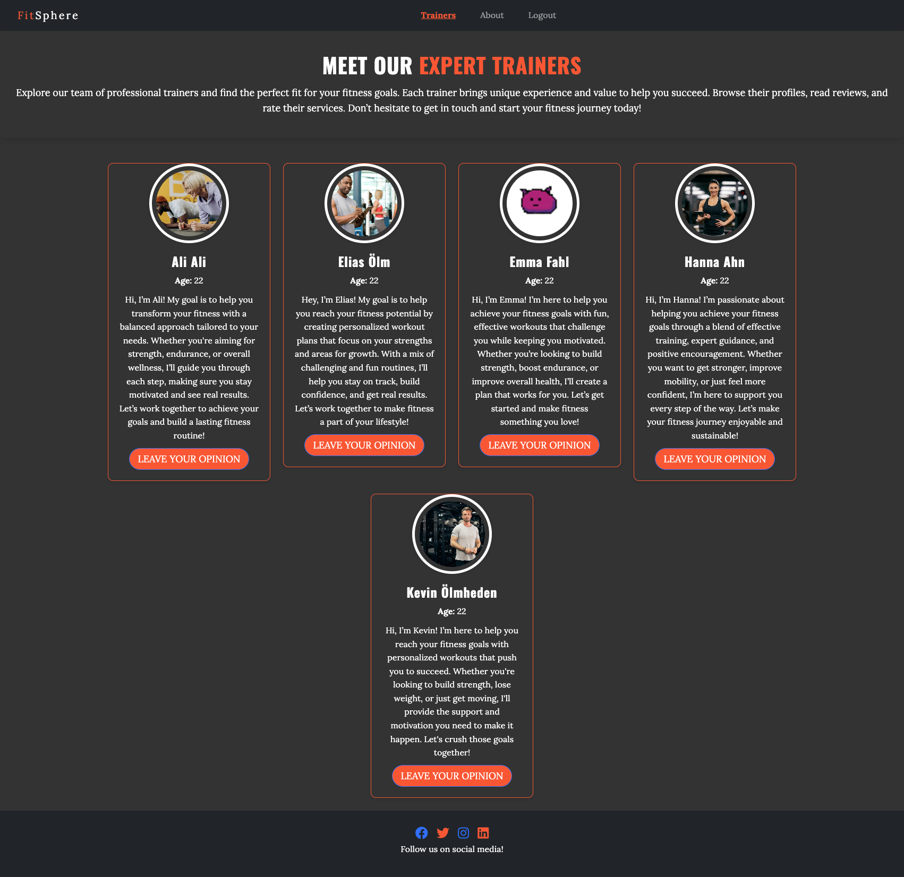
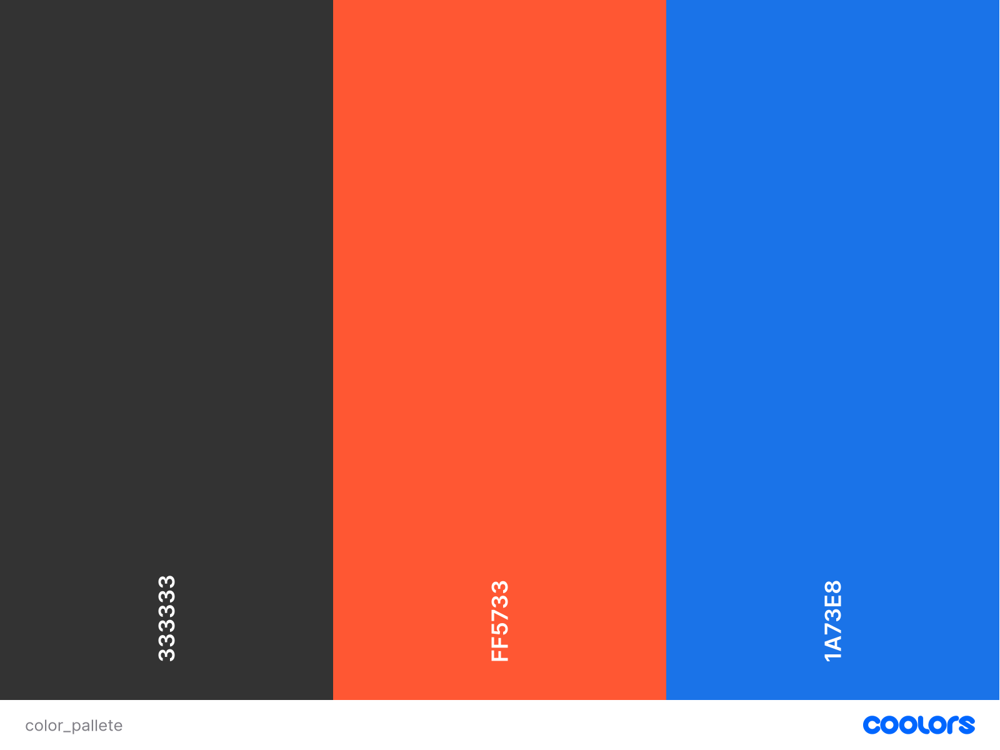

# Fitsphere

Live Version: [FitSphere] (https://fitsphere-5231c1c191f7.herokuapp.com/)

Repository: [Github] (https://github.com/Kevinolm10/FitSphere)

This website is devloped by [Kevin Ölmheden] (https://github.com/Kevinolm10)

## About

[FitSphere] (https://fitsphere-5231c1c191f7.herokuapp.com/) FitSphere is a platform dedicated to connecting users with certified personal trainers for customized fitness guidance. Whether you're looking for expert advice, personalized workout plans, or motivational support, FitSphere offers a diverse range of trainers to suit your fitness goals. Users can browse trainer profiles and leave feedback to help others make informed choices. Additionally, FitSphere provides companies the ability to hire and onboard qualified trainers, expanding their team to meet growing client demands. Join FitSphere today and take the next step toward achieving your fitness aspirations with the right support!

The role of the superuser is vital for the trainers to be onboarded, comments and ratings to be managed and users to be managed as well.
We as a company create the trainers and manages the rest to simplify everything for our audience!

## User Experience Design

### Strategy

The user experience (UX) design strategy for FitSphere focuses on creating an intuitive, engaging, and seamless interaction for both users (clients) and trainers, while ensuring that the platform meets business goals and drives customer satisfaction. The strategy is centered on simplifying navigation, enhancing usability, and fostering trust through transparency and feedback. 

### Target Audience

#### 1. **Clients (Users Seeking Personal Trainers)**
   - **Demographics**:
     - **Age**: Primarily 18-45 years old, including individuals in their 20s, 30s, and 40s who are looking to improve their fitness or meet specific health goals (e.g., weight loss, muscle gain, athletic performance).
     - **Gender**: Both male and female users.
     - **Location**: Geographic flexibility, but primarily users from urban areas with higher access to fitness professionals.
     - **Income Level**: Middle to upper-middle-income individuals who can afford personal training services.

   - **Psychographics**:
     - **Health & Fitness Enthusiasts**: People who are passionate about improving their health and fitness levels but require expert guidance and motivation to achieve their goals.
     - **Busy Professionals**: Clients with limited time for workouts who are looking for flexible and convenient ways to connect with trainers.
     - **Goal-Oriented**: Individuals with specific fitness goals such as weight loss, strength training, rehabilitation, or competitive sports performance.
     - **Technology-Savvy**: Comfortable using online platforms and mobile apps for booking, scheduling, and tracking training progress.

   - **Needs and Pain Points**:
     - **Convenient Access to Trainers**: They need an easy-to-navigate platform to discover trainers with the right expertise and availability.
     - **Trust & Transparency**: They seek to find trustworthy trainers with verified credentials and authentic reviews.
     - **Personalized Guidance**: Clients desire trainers who can provide tailored training plans and personalized coaching.
     - **Flexible Booking**: The ability to book sessions easily, with options for in-person or virtual training.
     - **Feedback System**: Clients want to leave feedback and reviews to help others make informed decisions and feel confident in their trainer choices.

---

#### 2. **Trainers (Fitness Professionals)**
   - **Demographics**:
     - **Age**: 25-50 years old, representing both established trainers with years of experience and younger, up-and-coming fitness professionals.
     - **Gender**: Both male and female trainers.
     - **Location**: Trainers in urban and suburban areas, with a strong presence in major cities.
     - **Income Level**: Varies based on the number of clients, but typically middle-income earners. Many trainers seek a platform to help them expand their client base.

   - **Psychographics**:
     - **Passionate About Fitness**: Trainers who are deeply passionate about helping people achieve their fitness goals, whether it’s weight loss, strength, or improving overall health.
     - **Entrepreneurial Spirit**: Trainers who are looking to grow their business, establish an online presence, and increase the number of clients they serve.
     - **Experienced Professionals**: Trainers with certifications, experience in specific fitness niches (e.g., strength training, yoga, rehabilitation), and a desire to share their expertise.
     - **Tech-Savvy**: Comfortable with online platforms for managing client bookings, payments, and communications.

   - **Needs and Pain Points**:
     - **Client Acquisition**: They need a platform that helps them easily find and connect with clients looking for their specific skills or training expertise.
     - **Platform for Reviews & Recognition**: They want clients to leave positive feedback and help them build a strong reputation within the platform.
     - **Manage Bookings & Payments**: An integrated system for managing schedules, payments, and client interactions in one place.
     - **Opportunities for Growth**: Trainers want access to business-building tools, marketing features, and a larger client base to scale their careers.
     - **User-Friendly Interface**: Trainers need an intuitive dashboard that allows them to track clients, schedule sessions, and maintain a professional online presence.

### User Stories

#### **First Time Visitor Goals**

| Issue ID    | User Story |
|-------------|-------------|
|[#1](https://github.com/Kevinolm10/FitSphere/issues/1)| As a First Time Visitor, visit the homepage so that I can learn about the website's services and quickly access other sections |
|[#2](https://github.com/Kevinolm10/FitSphere/issues/2)|As a First Time Visitor, I can view trainer profiles so that I can see the list of trainers, their pictures, and relevant information.|
|[#3](https://github.com/Kevinolm10/FitSphere/issues/6)|As a First Time Visitor, I can learn about the purpose of the site so that **I can understand what the website offers.|

#### **Frequent Visitor Goals**

| Issue ID    | User Story |
|-------------|-------------|
|[#4](https://github.com/Kevinolm10/FitSphere/issues/4)|As a Frequent User, I can sign up or sign in to my account so that I can access user-specific features.|
|[#5](https://github.com/Kevinolm10/FitSphere/issues/3)|As a Frequent User, I can capability so that leave comments and rate trainers so that I can share my feedback about their profiles.|
|[#6](https://github.com/Kevinolm10/FitSphere/issues/12)|As a Frequent User, I can edit and delete comments so that I constructively can tell the trainer how they are doing in real time.|

#### **Trainer Goals**

| Issue ID    | User Story |
|-------------|-------------|
|[#7](https://github.com/Kevinolm10/FitSphere/issues/11)|As a trainer, I can View user feedback so that so i know how im doing and what i can do better.|

#### **Admin Goals**

| Issue ID    | User Story |
|-------------|-------------|
|[#8](https://github.com/Kevinolm10/FitSphere/issues/7)|As an admin, I can log into the admin panel so that **I can manage the site’s content and users.|
|[#9](https://github.com/Kevinolm10/FitSphere/issues/9)|As an admin, I can manage trainer profiles so that **I can ensure the information is accurate and up-to-date.|
---

## Technologies used

- ### Languages:
    
    + [Python 3.12.2](https://www.python.org/downloads/release/python-3122/): the primary language used to develop the server-side of the website.
    + [JS](https://www.javascript.com/): the primary language used to develop interactive components of the website.
    + [HTML](https://developer.mozilla.org/en-US/docs/Web/HTML): the markup language used to create the website.
    + [CSS](https://developer.mozilla.org/en-US/docs/Web/css): the styling language used to style the website.

- ### Frameworks and libraries:

    + [Django](https://www.djangoproject.com/): python framework used to create all the logic.
    + [jQuery User Interface](https://jqueryui.com/) was used to create interactive elements.

- ### Databases:

    + [SQLite](https://www.sqlite.org/): was installed but not used during development. It was active and pushed to github, but later removed as it was a misstake. It should have been put in Gitignore. I will keep that in mind til future projects.
    + [PostgreSQL](https://www.postgresql.org/): the database used to store all the data.

- ### Other tools:

    + [Git](https://git-scm.com/): the version control system used to manage the code.
    + [Pip3](https://pypi.org/project/pip/): the package manager used to install the dependencies.
    + [Gunicorn](https://gunicorn.org/): the webserver used to run the website.
    + [Spycopg2](https://www.python.org/dev/peps/pep-0249/): the database driver used to connect to the database.
    + [Django-allauth](https://django-allauth.readthedocs.io/en/latest/): the authentication library used to create the user accounts.
    + [Heroku](https://www.heroku.com/): the cloud platform used to host the website.
    + [ElephantSQL](https://www.elephantsql.com/): the cloud database used to store all the data.
    + [GitHub](https://github.com/): used to host the website's source code.
    + [Gitpod](https://www.gitpod.io/): the IDE used to develop the website.
    + [Chrome DevTools](https://developer.chrome.com/docs/devtools/open/): was used to debug the website.
    + [Font Awesome](https://fontawesome.com/): was used to create the icons used in the website.
    + [Lucidchart](https://www.lucidchart.com/) was used to make a flowchart for the README file.
    + [Coolors](https://coolors.co/202a3c-1c2431-181f2a-0b1523-65e2d9-925cef-6b28e0-ffffff-eeeeee) was used to make a color palette for the website.
    + [pixabay](https://pixabay.com/): was used to get images for the website.
    + [W3C Validator](https://validator.w3.org/): was used to validate HTML5 code for the website.
    + [W3C CSS validator](https://jigsaw.w3.org/css-validator/): was used to validate CSS code for the website.
    + [JShint](https://jshint.com/): was used to validate JS code for the website.
    + [CI Python Linter](https://pep8ci.herokuapp.com/#): was used to validate Python code for the website.

---

## FEATURES

Please refer to the [FEATURES.md](FEATURES.md) file for all features-related documentation.

---

## Design Principles

The design of **FitSphere** follows modern design principles, with a strong focus on **simplicity** and **usability**. By adhering to the *Material Design* guidelines, we ensure that the user interface is intuitive and easy to navigate. The layout is crafted to be minimalistic, yet meaningful, without unnecessary distractions. Every design element is selected to enhance the user experience, ensuring that functionality is never compromised by aesthetics.

To create a clean and uncluttered experience, we emphasize **white space**, which not only adds visual appeal but also helps guide the user's attention to key areas. Given the multifunctionality of the platform, white space helps separate different components, making interactions more efficient and enjoyable.

### Color Scheme

The color palette of **FitSphere** is carefully curated to balance boldness with elegance. The primary color of the platform is `#333333` for the background, creating a sleek, modern feel. Accents of `#FF5733` bring energy and vibrancy to buttons, highlights, and key action items. Additionally, `#1a73e8` is used for buttons, offering a cool contrast that complements the warmer accent color and enhances the overall visual flow.

Here’s a closer look at the color scheme:

- **Background**: The background color of the application is set to `#333333`, creating a deep, dark environment that allows the content to stand out. This rich, dark tone exudes sophistication and is easy on the eyes for long viewing sessions.
- **Accent Color**: The vibrant `#FF5733` is used throughout the platform as an accent color. It draws attention to important elements like calls to action, links, and notifications, providing a strong contrast to the background and enhancing the overall visual appeal.
- **Buttons**: Buttons across the site are styled with `#1a73e8`, a calm yet impactful shade of blue. This color is used for key actions like form submissions, login buttons, and navigation elements, ensuring they stand out while maintaining a balanced look.
- **Footer**: The footer area is designed in `#333333` with **white** text, creating a clean and professional look that complements the overall design.

By combining these elements, **FitSphere** ensures a modern, functional, and visually pleasing experience for its users.

### Typography

Oswald is used for all headings and key elements throughout the app. Its bold, clean, and slightly condensed design makes it perfect for drawing attention to titles, subheadings, and important action items. The distinct character of Oswald ensures strong readability, helping users quickly navigate and focus on key sections of the interface.

For body text, we use Lora, a serif font known for its readability and elegance. Lora offers a comfortable reading experience for longer text, balancing the boldness of Oswald with its warm, inviting style. This combination ensures that both short and long content is easy to consume, providing a visually appealing contrast.

By pairing the modern, bold Oswald for headings with the elegant, readable Lora for body text, we create a typography system that is both functional and visually engaging. This balance enhances the user experience, guiding users through content while keeping the design clean and accessible.

### Imagery

- The main **background video** was brought from [pixabay](https://www.pixabay.com/) this website allowed Fitsphere to get an imersive video in the main cta section.

  

### Wireframes

#### Desktop

- [Desktop Home](documentation/wireframes/home.png)
- [Desktop Trainers](documentation/wireframes/trainers.png)
- [Desktop About](documentation/wireframes/about.png)
- [Desktop Comments](documentation/wireframes/comment-desk.png)
- [Desktop Admin](documentation/wireframes/desktop-admin.png)

#### Mobile

- [Mobile Home](documentation/wireframes/phone-home.png)
- [Mobile Trainers](documentation/wireframes/phone-trainers.png)
- [Mobile About](documentation/wireframes/phone-about.png)
- [Mobile Sign in](documentation/wireframes/phone-signin.png)
- [Mobile Sign up](documentation/wireframes/phone-signup.png)

---

## Flowcharts

This application is designed to accommodate users with different roles, each having specific expectations and access to distinct functionalities. To provide a clearer picture of how the system operates and how various roles interact with the platform, we’ve created a detailed **website functionality flowchart**.

The flowchart offers a high-level overview of the user journey across the website, beginning from the user’s first interaction with the platform to navigating the various sections. It highlights the core processes and interactions, ensuring that all users—whether they are visitors, registered users, trainers, or admins—can easily understand how actions are connected within the platform.

The flowchart was designed using [Lucidchart](https://www.lucidchart.com/), providing a simple and intuitive representation of the website’s structure and user experience.

- [Website Functionality Flowchart](documentation/flowcharts/flowchart.png)

### Flowchart Breakdown:

- **Homepage Interaction**: The starting point for all users, whether they are signing up, logging in, or simply exploring the site.
- **Navigation Paths**: A depiction of how users navigate between different sections of the website, such as their profile management, feedback forms, trainer pages, and other key features.
- **Trainer Feedback System**: Shows how users (signed in) can rate and leave feedback on trainers, as well as edit or delete their comments. This feedback mechanism is central to user interactions with the platform.

The flowchart aims to provide a comprehensive view of the essential processes that power the website, offering insight into how users can efficiently engage with the platform’s features, based on their role.

Each flowchart is designed to clarify the user's journey through the website, ensuring that all stakeholders—be it developers, administrators, or users—fully understand the steps involved in interacting with the system.

---

## Information Architecture

### Database

* The database during the full project was developed with PostgreSQL.

### Data Modeling

* The ERD was created using [Lucidchart](https://www.lucidchart.com/).

- As a point for health blog, it was meant to be. The health blog was kept in the database Scheme for the future as it is still an issue for the future in the project.

- [Database Scheme](documentation/diagrams/er-diagram.png)

---
## Testing

Please refer to the [TESTING.md](TESTING.md) file for all test-related documentation.

---

## Deployment

- The app was deployed to [Heroku](https://www.heroku.com/).

- The app can be reached by the [link](https://fitsphere-5231c1c191f7.herokuapp.com/).

Please refer to the [DEPLOYMENT.md](DEPLOYMENT.md) file for all deployment-related documentation.

---

## Future Improvements

- In the future i would like for it to be more content implemented for the user. 
- The password reset must be finished as well as a more robust system to handle authentication.
- The admin panel should be more custom to handle all of this.
- I would also like to add more detail to the comments.
- Optimization is important and is one thing i would have liked to do. The css file needs cleaning and optimizing as well as the javascript file and all images/videos.
- I would like to add some more value to the user and trainer.

---

## Credits

- [GitHub](https://github.com/) for giving the idea of the project's design.
- [Django](https://www.djangoproject.com/) for the framework.
- [Heroku](https://www.heroku.com/): for the hosting of the website.
- [PostgreSQL]: Code institute provided the database.
- [pixabay](https://www.bgjar.com/): for the free access to the imagery and videos.
- [Font awesome](https://fontawesome.com/): for the free access to icons.
- [Heroku](https://www.heroku.com/): for the free hosting of the website.
- [jQuery](https://jquery.com/): for providing varieties of tools to make standard HTML code look appealing.
- [Coolors](https://coolors.co/): for providing a free platform to generate your own palette.
- [Postgresql](https://www.postgresql.org/): for providing a free database.
- [Codemy.com](https://www.youtube.com/watch?v=N-PB-HMFmdo): for providing a free video on how to implement pagination in the project.
- [Responsive Viewer](https://chrome.google.com/webstore/detail/responsive-viewer/inmopeiepgfljkpkidclfgbgbmfcennb/related?hl=en): for providing a free platform to test website responsiveness
- [GoFullPage](chrome://extensions/?id=fdpohaocaechififmbbbbbknoalclacl): for allowing to create free full web page screenshots;
- [Favicon Generator. For real.](https://realfavicongenerator.net/): for providing a free platform to generate favicons.

---

## Acknowledgments

- [Mentor] Who always gives me good and well constructed feedback.