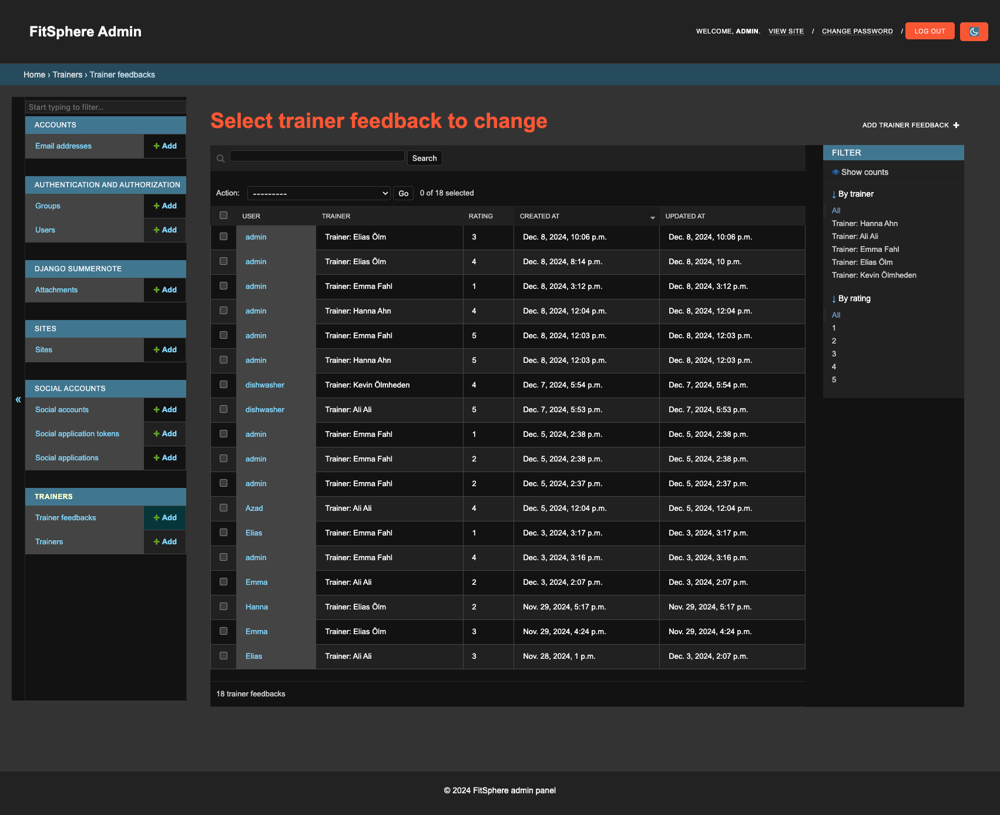

# Testing

## Manual Testing

Testing was done throughout site development, for each feature before it was merged into the master file.

Only manual testing has been done throughout and after development.

|     | User Actions           | Expected Results | Y/N | Comments    |
|-------------|------------------------|------------------|------|-------------|
| Sign Up     |                        |                  |      |             |
| 1           | Click on the register button | User is directed to sign up: Login/SignUp | Y |          |
| 2           | Click on Sign in button | Redirection to Sign in page | Y |          |
| 3           | Click Get Started button in the hero section | Redirection to Sign Up page | Y |          |
| 4           | Click on the Login link in the form | Redirection to Login page | Y |          |
| 5           | Enter valid username | if username is valid, register | Y |          |
| 6           | Enter valid email (optional) | no validation set but it works | Y |          |
| 10          | Enter valid password | Field will only accept passwords with validation criteria | Y |          |
| 11          | Enter valid password confirmation | Field will only accept the same password from the previous field | Y |          |
| Log In      |                        |                  |      |             |
| 1           | Click on the Get log in button | User is directed to the log in page | Y |          |
| 2           | Click on sign up button | Redirection to sign up page | Y |          |
| 4           | Enter valid username | Field will only accept the correct username | Y |          |
| 5           | Enter valid password | Field will only accept correct passwords | Y |          |
| 6           | Click on the Sign In button | Takes user to trainers page | Y |          |
| 7           | Clicks "Forgot Password" instead of "Sign In" | Redirects user to forgot password page | Y |          |
| 8           | Click "Menu", choose "Logout" | Takes user to log out page to confirm logout | Y |          |
| 9           | Click "Logout" button  in the center of the page| Redirects user to home page | Y |          |
| Trainers     |            |                  |      |             |
| 1           | If signed out leave feedback btn is not visable | btn is not visable | Y |          |
| 2            | If signed in leave feedback btn is visable | btn is visable | Y |          |
| 3           | Click on the leave feedback btn | Redirected to trainer profiles | Y |          |
| Trainer Profiles     |            |                  |      |             |
| 1           | If comments have yet to be made, it says so | User is notified if he is the first user to comment | Y |          |
| 2           | When the user comments, he or she gets a validation msg | The message shows under the nav | Y |          |
| 3           | The User can add stars and get the average of stars | The stars are added on the comment and the average is visable on the trainer | Y |          |
| 4           | The user can edit their own comments | edit button works and brings up text input | Y |          |
| 5           | The user can delete their comment | delete button works as intended | Y |          |
| 6           | The user can edit their star rating | star dropdown works as intended | Y |          |
| Admin      |          |                  |      |             |
| 1           | The admin can create, edit and delete users | users gets created, edited or deleted | Y |          |
| 2           | The admin can create, edit and delete trainers | trainers gets created, edited or deleted | Y |          |
| 3           | The admin can create, edit and delete feedback | feedback gets created, edited or deleted | Y |          |

---

## Testing User Story

| First Time Visitor Goals | Requirement met | Image |
| ------------------------- | --------------- | ----- |
| As a First Time Visitor, visit the homepage so that I can learn about the website's services and quickly access other sections | Press home in nav or navbar logo |  |
| As a First Time Visitor, I can view trainer profiles so that I can see the list of trainers, their pictures, and relevant information. | Trainers page or more info on profile |  |
| As a First Time Visitor, I can learn about the purpose of the site so that **I can understand what the website offers. | About page |  |

| Frequent Visitor Goals    | Requirement met | Image |
| ------------------------- | --------------- | ----- |
| As a Frequent User, I can sign up or sign in to my account so that I can access user-specific features. | Sign in page |  |
| As a Frequent User, I can leave comments and rate trainers so that I can share my feedback about their profiles. | Trainer profile |  |
| As a Frequent User, I can edit and delete comments so that I constructively can tell the trainer how they are doing in real time. | edit, delete and save btns on trainer profile page |  |

| Trainer Goals | Requirement met | Image |
| ------------------------- | --------------- | ----- |
| As a Trainer, I can View user feedback so that so i know how im doing and what i can do better. | Trainer profile or admin interface |  |

| Admin Goals | Requirement met | Image |
| ------------------------- | --------------- | ----- |
| As a Admin, I can log into the admin panel so that **I can manage the site’s content and users. | Trainer profile or admin interface |  |
| As a Admin, I can manage trainer profiles so that **I can ensure the information is accurate and up-to-date. | Trainer profile or admin interface |  |

## Bugs

### Known bugs

- Whitenoise does not collect static for me which has resulted in me having collect static files manually every time i want to deploy. 

- Some buttons and functionality on the site sometimes loses css and i have not found a solution for this, could be related to the static files not being collected properly.

- Some parts of the website sometimes loses "connection" or the view itself when debug is set to false.

### Solved bugs

- The whitenoise bug can be considered mostly solved since i am collecting the static files manually.

- Solved a bug where the views for saving a comment would not register. I made the view and form less complicated and made it more quality and it now works.

- multiple css bugs regarding bootstrap and hidden html elements which i have found through the developer console > application > thefile.html and could edit it through there.

---

## Automated testing

No automated testing was made during this project unfortunately as there was no time.

## Validation:
### HTML Validation:

- [Full HTML Validation Report](documentation/validation/html_validation.pdf)

- No errors or warnings were found when passing through the official [W3C](https://validator.w3.org/) validator. This checking was done manually by copying the view page source code and pasting it into the validator.

### CSS Validation:

#### Style.css

- [Full CSS Validation Report](documentation/validation/css_validation.png)

- No errors or warnings were found when passing through the official [W3C (Jigsaw)](https://jigsaw.w3.org/css-validator/#validate_by_uri) validator except for the warnings about the use of css root variables and webkits for the box-shadow. However, css code works perfectly on various devices.

#### Custom admin panel css

- [Full Custom CSS Validation Report](documentation/validation/custom-css-validation.png)

- No errors or warnings were found when passing through the official [W3C (Jigsaw)](https://jigsaw.w3.org/css-validator/#validate_by_uri) validator.

### JS Validation:

 [Full JS Validation Report](documentation/validation/js-validation.png)

- No errors or warning messages were found when passing through the official [JSHint](https://www.jshint.com/) validator. However, the validator has pointed out that the module variable is not used (eversion 6) and unused variables which in fact are used.

### Python Validation:

The images are shown in the apps order! Example: 
- About app image
- About apps
- About views
Etc.

- [Full Python Validation Report](documentation/validation/python_validation.pdf)

- No errors were found when the code was passed through Valentin Bryukhanov's [online validation tool](https://pep8ci.herokuapp.com/#). According to the reports, the code is [Pep 8-compliant](https://legacy.python.org/dev/peps/pep-0008/). This checking was done manually by copying python code and pasting it into the validator.

---
## Lighthouse Report

### Home Page

### Trainers Page

### Trainers Page (signed in)

### Trainer Profiles Page

### About Page

### Register Page

### Log In Page

### Log out Page

---

## Compatibility

Testing was conducted on the following browsers;

- Arc;

- Chrome;

- Firefox;

---

# Responsiveness

The responsiveness was checked manually by using devtools (Chrome) throughout the whole development. It was also checked with [Responsive Viewer](https://chrome.google.com/webstore/detail/responsive-viewer/inmopeiepgfljkpkidclfgbgbmfcennb/related?hl=en) Chrome extension.

[Responsiveness Report](documentation/responsiveness/responsiveness.png)

---